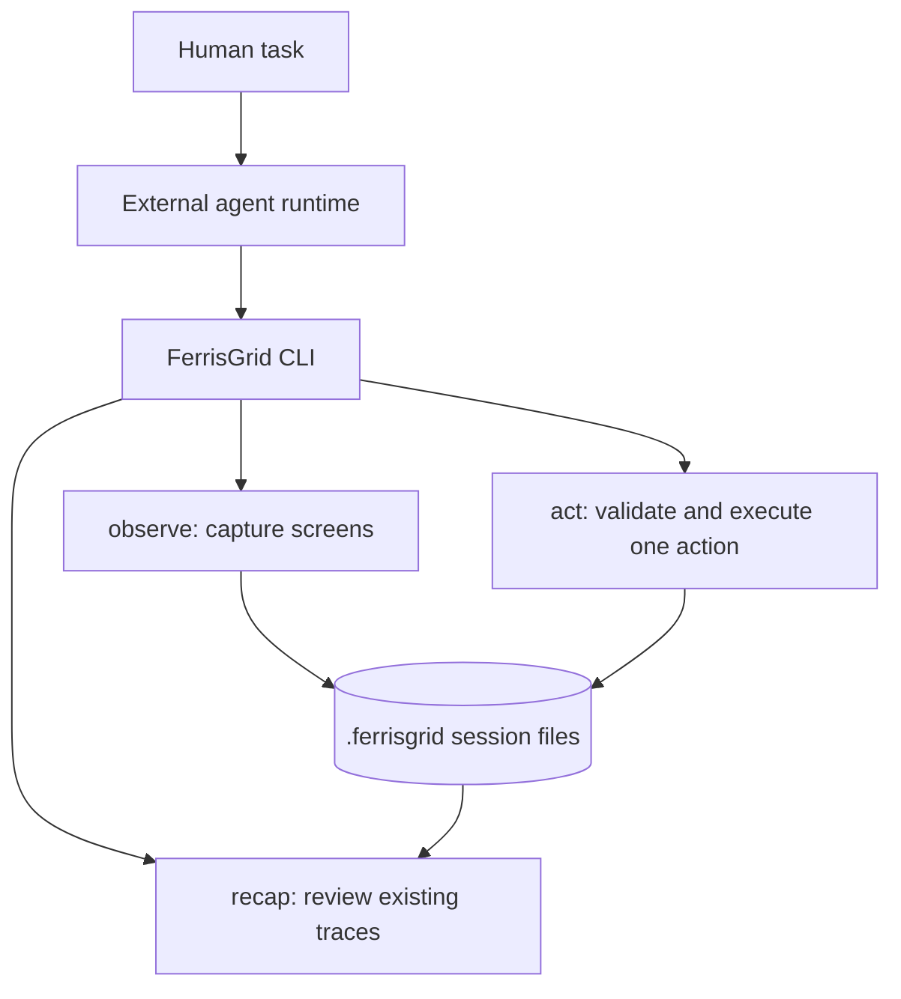

# Architecture

FerrisGrid is a local, single-step visual control primitive.



## Principles

- **Single-step by default:** one observation or one action per invocation.
- **Agent owns reasoning:** FerrisGrid does not choose the next action.
- **Multi-screen first:** screen IDs disambiguate observation and action targets.
- **Local traceability:** every meaningful step writes local artifacts.
- **Compact Markdown interface:** tool output is designed for agents to read directly.
- **Coordinate correctness before speed:** coordinates must map deterministically.
- **Policy-gated execution:** actions are validated before OS input is emitted.

## Workspace layout

```text
crates/
  ferrisgrid-cli/
  ferrisgrid-core/
  ferrisgrid-capture/
  ferrisgrid-input/
  ferrisgrid-export/
```

The CLI owns argument parsing and Markdown output. Core owns sessions, orchestration, action parsing, validation, and result types. Capture and input crates hide platform-specific backends.
