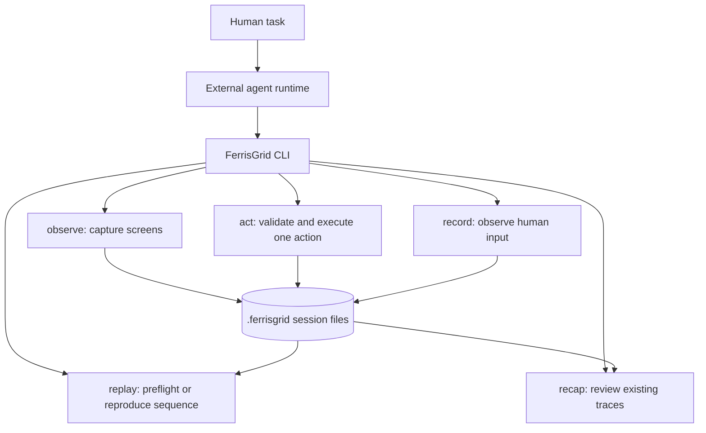

# Architecture

FerrisGrid is a local visual-control primitive. Its agent protocol is single-step;
its human demonstration commands record and explicitly replay bounded sequences.



## Principles

- **Single-step by default:** one observation or one action per invocation.
- **Agent owns reasoning:** FerrisGrid does not choose the next action.
- **Multi-screen first:** screen IDs disambiguate observation and action targets.
- **Local traceability:** every meaningful step writes local artifacts.
- **Compact Markdown interface:** tool output is designed for agents to read directly.
- **Coordinate correctness before speed:** coordinates must map deterministically.
- **Policy-gated execution:** actions are validated before OS input is emitted.

## Workspace layout

```text
crates/
  ferrisgrid-cli/
  ferrisgrid-core/
  ferrisgrid-capture/
  ferrisgrid-input/
  ferrisgrid-record/
  ferrisgrid-export/
```

The CLI owns argument parsing and Markdown output. Core owns sessions, action parsing,
validation, coordinate mapping, and result types. Capture and input crates hide
platform-specific backends. The record crate owns native event observation, semantic
event reduction, rolling checkpoint selection, sequence serialization, preflight, and
replay orchestration.

## Demonstration pipeline

`record` observes global macOS mouse and keyboard events without suppressing ordinary
input. A reducer turns raw events into the existing action vocabulary: clicks,
double-clicks, same-screen drags, debounced scrolls, grouped typing, boundary keys, and
hotkeys. Standalone pointer motion is not stored.

A low-rate rolling capture cache keeps recent frames in memory. FerrisGrid writes an
initial frame, pre/post frames around semantic checkpoints, and a final frame instead
of persisting continuous video or one screenshot per character. Action numbers and
frame numbers are intentionally independent.

`replay` parses the complete sequence, maps recorded displays by fingerprint or an
explicit `--map-screen`, and validates every action before any input is emitted. It is
read-only by default. Live execution requires `--execute`, is capped by
`--max-actions`, uses a fixed inter-action delay, and writes a separate replay session.

Native event recording currently requires macOS 13 or newer. Cross-screen drags and
native Windows/Linux recorders are not yet supported. Replay can use any available
FerrisGrid capture/input backend after successful preflight.
